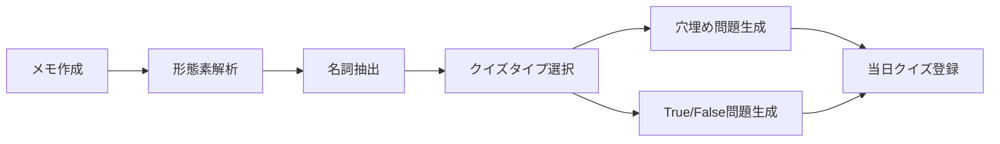
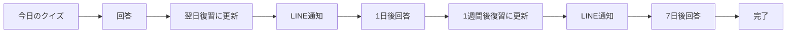

# 📚 読書メモ自動クイズ生成システム

読んだ本のメモから自動で問題（穴埋め/True or False）を生成し、当日回答→翌日LINE通知→翌週も同フローで復習できる仕組みです。

## 🎯 システム概要

### 主な機能
- **メモ作成**: 読書メモをWebで作成
- **自動クイズ生成**: 日本語形態素解析による問題自動生成
- **復習システム**: エビングハウスの忘却曲線に基づく復習スケジュール
- **LINE通知**: 復習タイミングでのプッシュ通知
- **学習統計**: 継続率、正答率などのKPI表示

### 技術スタック
- **Frontend**: Next.js 14 (App Router), TypeScript, Tailwind CSS
- **Backend**: Next.js API Routes
- **Database**: Supabase (PostgreSQL)
- **NLP**: kuromoji.js (日本語形態素解析)
- **Messaging**: LINE Messaging API
- **Hosting**: Vercel
- **Scheduler**: Vercel Cron Jobs

## 📊 データモデル

```sql
-- ユーザー（LINE連携）
User(id, line_user_id, email, display_name, notification_enabled, notification_time)

-- メモ
Memo(id, user_id, title, text, source_book_id, created_at)

-- クイズ（自動生成）
Quiz(id, memo_id, user_id, type[cloze,tf], stem, answer, choice, scheduled_at, status[today,day1,day7,done])

-- 回答履歴
Attempt(id, quiz_id, user_id, user_answer, is_correct, answered_at)

-- 通知ログ
NotificationLog(id, quiz_id, user_id, channel[line], sent_at, status, retry_count)
```

## 🔄 システムフロー

### 1. メモ作成 → クイズ生成


### 2. 復習スケジュール


## 🧠 クイズ生成ロジック

### 穴埋め問題（Cloze）
1. テキストを文に分割
2. 形態素解析で名詞を抽出
3. 最長名詞または頻出名詞を選択
4. 対象語を「____」に置換

```typescript
// 例: 「7つの習慣は効果的な人生の原則である」
// → 「____は効果的な人生の原則である」（答え: 7つの習慣）
```

### True/False問題
1. 一文をランダム選択
2. 以下の方法で偽文を作成：
   - 否定の付与/除去
   - 数値±10%改変
   - 固有名詞の同カテゴリ置換

```typescript
// 例: 「日本の首都は東京である」
// → 「日本の首都は大阪である」（答え: False）
```

## 📱 LINE連携機能

### Webhook処理
- 友だち追加時のウェルカムメッセージ
- テキストメッセージへの自動応答
- 各種コマンド（「設定」「統計」「ヘルプ」等）

### Push通知
- 復習タイミングでの自動通知
- 署名付きトークンによる安全なクイズリンク
- リトライ機能（24時間後に1回）

## ⚙️ スケジューラ機能

### 毎日0時実行: クイズステータス更新
```typescript
today → day1 → day7 → done
```

### 毎日9時実行: 通知送信
- ユーザーの通知設定時間を考慮
- 重複通知の防止
- 送信結果のログ記録

## 📈 KPI・統計機能

### 基本指標
- メモ作成数
- クイズ生成数
- 総回答数
- 正答率
- 継続日数

### 詳細分析
- 日別学習状況
- 週別継続率
- 最近の回答履歴
- 学習パターン分析

## 🔧 API エンドポイント

### メモ関連
```
POST   /api/memos              # メモ作成（クイズ自動生成）
GET    /api/memos              # メモ一覧取得
GET    /api/memos/[id]         # メモ詳細
PUT    /api/memos/[id]         # メモ更新
DELETE /api/memos/[id]         # メモ削除
```

### クイズ関連
```
GET    /api/quizzes            # クイズ一覧
GET    /api/quizzes/[id]       # クイズ詳細
POST   /api/quizzes/[id]/answer # 回答送信
PUT    /api/quizzes/[id]       # ステータス更新
```

### LINE関連
```
POST   /api/line/webhook       # LINE Webhook
POST   /api/line/notify        # 通知送信
```

### スケジューラ関連
```
POST   /api/scheduler/update-quiz-status    # ステータス更新
POST   /api/scheduler/send-notifications   # 通知送信
```

### ユーザー関連
```
GET    /api/users/settings     # 設定取得
PUT    /api/users/settings     # 設定更新
GET    /api/users/stats        # 統計取得
```

## 🎨 UI/UX設計

### レスポンシブ対応
- モバイルファーストデザイン
- Tailwind CSSによる一貫したスタイリング
- アクセシビリティ配慮

### ユーザーフロー
1. **ホーム** → メモ作成 or 本探し
2. **メモ作成** → 自動クイズ生成 → 今日のクイズ
3. **クイズ回答** → 結果表示 → 次の問題 or 完了
4. **LINE通知** → クイズページ → 回答 → 復習完了

## 🔒 セキュリティ

### 認証・認可
- Supabase RLS（Row Level Security）
- LINE署名検証
- API認証キー

### データ保護
- 個人情報の適切な管理
- 暗号化トークン
- セキュアな通信（HTTPS）

## 🚀 パフォーマンス

### 最適化
- 静的生成（SSG）の活用
- 画像最適化
- データベースインデックス
- キャッシュ戦略

### スケーラビリティ
- サーバーレス関数
- 自動スケーリング
- CDN活用

## 📋 運用・監視

### ログ管理
- アプリケーションログ
- エラートラッキング
- パフォーマンス監視

### 定期メンテナンス
- データベース最適化
- 不要データの削除
- セキュリティアップデート

## 🎯 今後の拡張予定

### 機能追加
- [ ] 複数選択問題の対応
- [ ] 画像付きクイズ
- [ ] 音声読み上げ機能
- [ ] グループ学習機能
- [ ] ゲーミフィケーション要素

### 技術改善
- [ ] AI/ML活用による問題品質向上
- [ ] リアルタイム通知
- [ ] PWA対応
- [ ] 多言語対応

## 📖 ドキュメント

- [デプロイメントガイド](./DEPLOYMENT_GUIDE.md)
- [スケジューラ設定](./SCHEDULER_SETUP.md)
- [API仕様書](./API_SPECIFICATION.md)

## 🤝 コントリビューション

1. Fork the repository
2. Create your feature branch
3. Commit your changes
4. Push to the branch
5. Create a Pull Request

## 📄 ライセンス

MIT License

---

このシステムにより、効果的な読書記録と継続的な学習をサポートし、知識の定着を促進します。