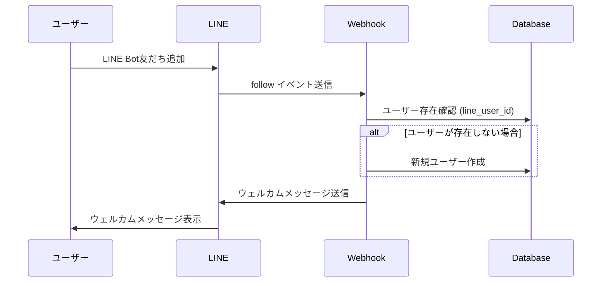
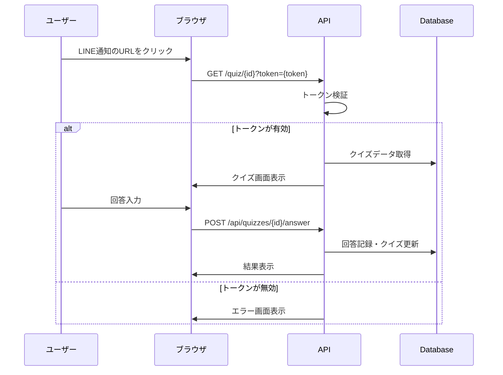
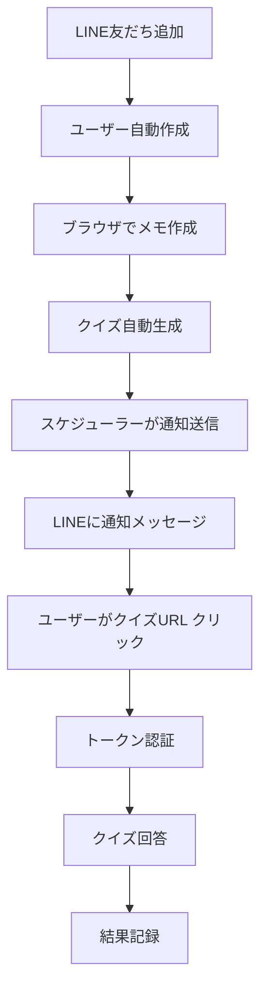

# ブラウザユーザーとLINEアカウントの紐づけシステム

## 概要

本システムでは、ブラウザ上のユーザーとLINEアカウントを紐づけて、シームレスな読書メモ&クイズ体験を提供しています。このドキュメントでは、その仕組みと実装について詳しく説明します。

## システム構成

### 1. ユーザー管理の二重構造

本システムでは、以下の2つの認証・ユーザー管理システムが並行して動作しています：

#### A. ブラウザ管理者認証（管理画面用）
- **目的**: 管理画面へのアクセス制御
- **実装**: `src/components/auth/AuthContext.tsx`
- **認証方式**: 固定のメールアドレス・パスワード
- **対象**: システム管理者のみ

#### B. LINEユーザー管理（エンドユーザー用）
- **目的**: クイズ・メモ機能の利用
- **実装**: `src/lib/quiz-db.ts` の `UserService`
- **認証方式**: LINE Bot友だち追加による自動登録
- **対象**: 一般利用者

## データベース設計

### usersテーブル構造

```sql
CREATE TABLE IF NOT EXISTS users (
  id UUID DEFAULT gen_random_uuid() PRIMARY KEY,
  line_user_id VARCHAR(255) UNIQUE,           -- LINEユーザーID（キー）
  email VARCHAR(255) UNIQUE,                  -- メールアドレス（未使用）
  display_name VARCHAR(100),                  -- 表示名
  avatar_url TEXT,                           -- アバター画像URL
  notification_enabled BOOLEAN DEFAULT true, -- 通知設定
  notification_time TIME DEFAULT '09:00:00', -- 通知時間
  created_at TIMESTAMP WITH TIME ZONE DEFAULT NOW(),
  updated_at TIMESTAMP WITH TIME ZONE DEFAULT NOW()
);
```

### 重要なポイント

1. **line_user_id**: LINEから提供される一意なユーザーIDが主要な識別子
2. **email**: 現在は未使用（将来的な拡張のために保持）
3. **UUID**: 内部的なユーザーID（他のテーブルとの関連付けに使用）

## ユーザー登録・紐づけフロー

### 1. LINE Bot友だち追加による自動登録



#### 実装コード（抜粋）

```typescript
// src/app/api/line/webhook/route.ts
async function handleFollowEvent(event: any) {
  const lineUserId = event.source.userId;
  
  // ユーザーを作成または取得
  const user = await UserService.findOrCreateByLineId(lineUserId, {
    display_name: `User_${lineUserId.slice(-6)}`,
    notification_enabled: true,
    notification_time: '09:00:00'
  });
  
  // ウェルカムメッセージを送信
  const welcomeMessages = createWelcomeMessage();
  await lineClient.replyMessage(event.replyToken, welcomeMessages);
}
```

### 2. ユーザー識別方法

#### UserService.findOrCreateByLineId の動作

```typescript
// src/lib/quiz-db.ts
static async findOrCreateByLineId(lineUserId: string, userData: Partial<User>): Promise<User | null> {
  let user = await this.findByLineUserId(lineUserId);
  
  if (!user) {
    user = await this.create({
      ...userData,
      line_user_id: lineUserId
    });
  }

  return user;
}
```

## クイズアクセス認証システム

### トークンベース認証

ブラウザユーザーがクイズにアクセスする際は、セキュアなトークンベース認証を使用します。

#### 1. トークン生成

```typescript
// src/lib/line-utils.ts
export function generateQuizToken(quizId: string, userId: string): string {
  const payload = {
    quizId,
    userId,
    timestamp: Date.now(),
    expires: Date.now() + (24 * 60 * 60 * 1000) // 24時間後
  };

  const secret = process.env.QUIZ_TOKEN_SECRET || 'default-secret';
  return CryptoJS.AES.encrypt(JSON.stringify(payload), secret).toString();
}
```

#### 2. LINE通知メッセージでのURL生成

```typescript
// クイズ通知メッセージを作成
export function createQuizNotificationMessage(quizId: string, userId: string, quizType: 'cloze' | 'tf') {
  const token = generateQuizToken(quizId, userId);
  const baseUrl = process.env.NEXT_PUBLIC_BASE_URL;
  const quizUrl = `${baseUrl}/quiz/${quizId}?token=${token}`;
  
  return {
    type: 'template',
    template: {
      type: 'buttons',
      actions: [{
        type: 'uri',
        label: 'クイズに挑戦する',
        uri: quizUrl
      }]
    }
  };
}
```

#### 3. トークン検証フロー



#### 4. トークン検証実装

```typescript
// src/app/api/auth/verify-token/route.ts
export async function POST(request: NextRequest) {
  const { token, quizId } = await request.json();
  
  // トークンを検証
  const tokenData = verifyQuizToken(token);
  
  if (!tokenData || tokenData.quizId !== quizId) {
    return NextResponse.json({ error: 'Invalid token' }, { status: 401 });
  }

  return NextResponse.json({
    userId: tokenData.userId,  // LINE User ID
    quizId: tokenData.quizId
  });
}
```

## データの流れ

### 1. メモ作成からクイズ生成まで



### 2. ユーザーIDの変換

システム内では複数のユーザーIDが使用されます：

- **LINE User ID**: LINEから提供される文字列ID（例：`U1234567890abcdef`）
- **Internal UUID**: データベース内部で使用するUUID（例：`550e8400-e29b-41d4-a716-446655440000`）

#### 変換処理の実装

```typescript
// クイズ回答処理での変換例
export async function POST(request: NextRequest, { params }: { params: { id: string } }) {
  const { userAnswer, userId } = await request.json(); // userId = LINE User ID
  
  // LINE User IDから内部UUIDを取得
  const user = await UserService.findByLineUserId(userId);
  
  // 回答記録には内部UUIDを使用
  const attempt = await AttemptService.create({
    quiz_id: quiz.id,
    user_id: user.id, // 内部UUID
    user_answer: userAnswer,
    is_correct: isCorrect
  });
}
```

## セキュリティ考慮事項

### 1. トークンのセキュリティ

- **暗号化**: AES暗号化でトークンを保護
- **有効期限**: 24時間の有効期限設定
- **ワンタイム性**: クイズIDとユーザーIDの組み合わせで一意性を保証

### 2. LINE Webhook セキュリティ

```typescript
// 署名検証
export function verifySignature(body: string, signature: string): boolean {
  const hash = CryptoJS.HmacSHA256(body, config.channelSecret).toString(CryptoJS.enc.Base64);
  return hash === signature;
}
```

### 3. データベースアクセス制御

- Row Level Security (RLS) による適切なアクセス制御
- ユーザーは自分のデータのみアクセス可能

## 運用上の注意点

### 1. ユーザーの重複防止

- `line_user_id` にUNIQUE制約を設定
- `findOrCreateByLineId` メソッドで重複作成を防止

### 2. 通知設定の管理

- ユーザーごとの通知有効/無効設定
- 通知時間のカスタマイズ機能

### 3. データの整合性

- 外部キー制約による関連データの整合性保証
- カスケード削除による関連データの自動削除

## 拡張可能性

### 1. 将来的な認証方式の追加

現在の設計では、将来的に以下の認証方式を追加できます：

- メールアドレス認証
- ソーシャルログイン（Google、Twitter等）
- 電話番号認証

### 2. マルチチャンネル対応

LINE以外のメッセージングプラットフォームへの対応も可能です：

- Discord Bot
- Slack App
- Telegram Bot

## トラブルシューティング

### よくある問題と解決方法

1. **ユーザーが見つからない**
   - LINE友だち追加が正常に処理されているか確認
   - Webhookログの確認

2. **トークンが無効**
   - トークンの有効期限（24時間）を確認
   - QUIZ_TOKEN_SECRET環境変数の設定確認

3. **通知が届かない**
   - LINE_CHANNEL_ACCESS_TOKENの設定確認
   - ユーザーの通知設定確認

## 関連ファイル

### 主要実装ファイル

- `src/lib/quiz-db.ts`: ユーザー管理サービス
- `src/app/api/line/webhook/route.ts`: LINE Webhook処理
- `src/lib/line-utils.ts`: LINE関連ユーティリティ
- `src/app/api/auth/verify-token/route.ts`: トークン認証
- `src/app/quiz/[id]/token/page.tsx`: トークンベースクイズページ

### データベーススキーマ

- `supabase/quiz_schema_fixed.sql`: 最新のスキーマ定義

### 設定ファイル

- `src/types/index.ts`: 型定義
- `.env`: 環境変数設定

## まとめ

本システムは、LINEを主要なユーザーインターフェースとして使用し、ブラウザでのクイズ体験をシームレスに提供する設計となっています。トークンベース認証により、セキュリティを保ちながら使いやすいユーザー体験を実現しています。