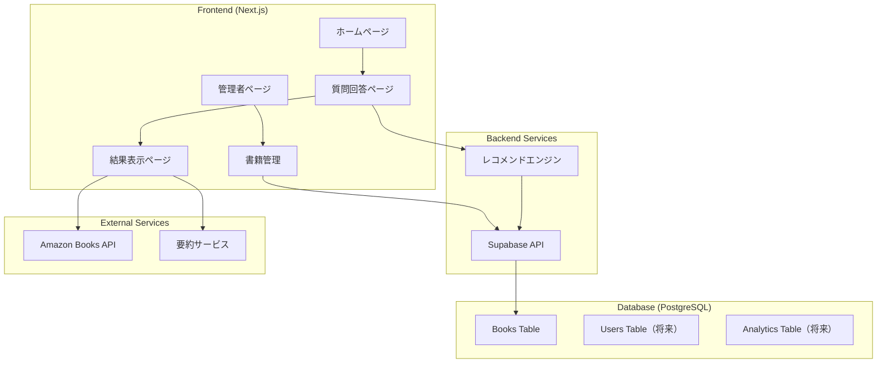
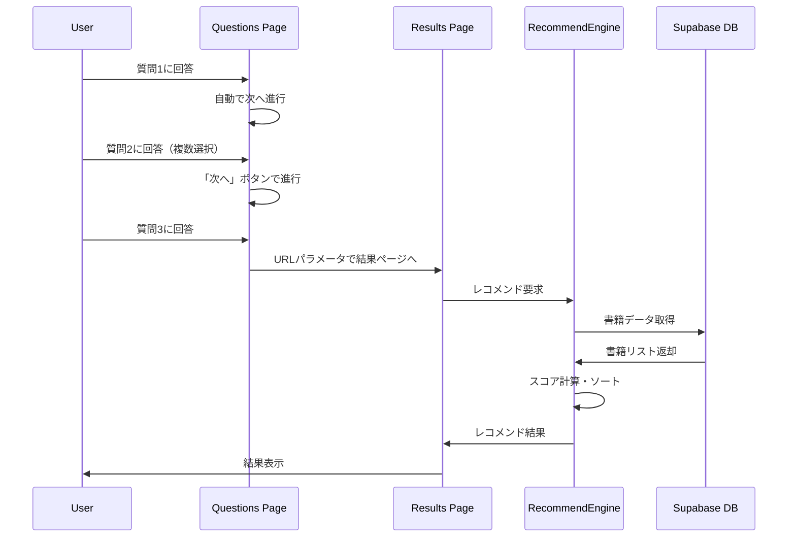
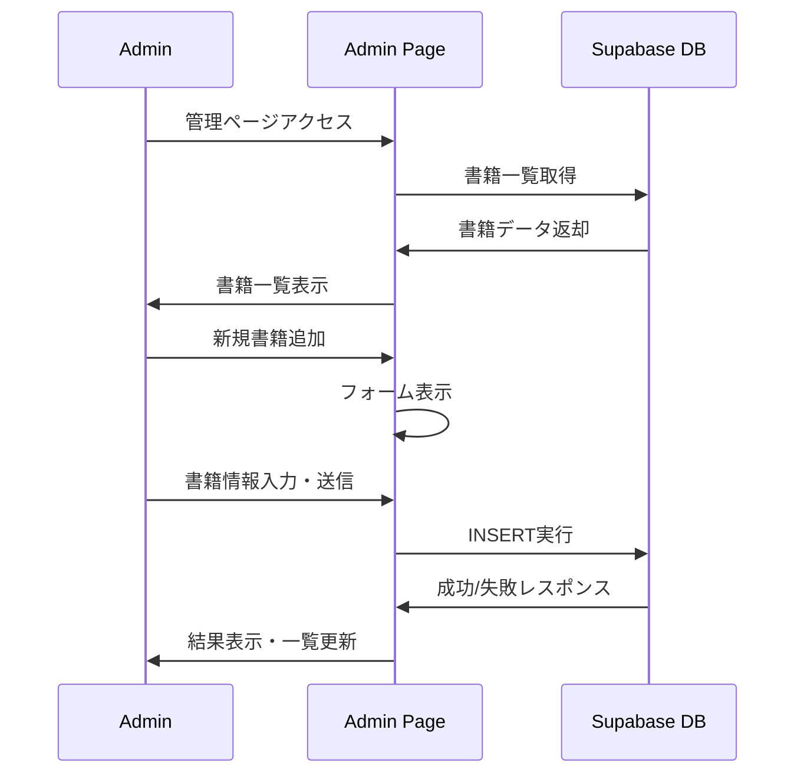

# 🏗️ システムアーキテクチャ設計書

## 概要

質問ベースの書籍レコメンドシステムの技術アーキテクチャ、データ設計、およびシステム構成について説明します。

---

## システム構成図



---

## 技術スタック

### フロントエンド
- **Framework**: Next.js 14 (App Router)
- **Language**: TypeScript
- **Styling**: Tailwind CSS + カスタムiOS風デザインシステム
- **State Management**: React Hooks (useState, useEffect)
- **Routing**: Next.js App Router

### バックエンド
- **BaaS**: Supabase (PostgreSQL + Auth + API)
- **API**: Next.js API Routes (必要に応じて)
- **Authentication**: Supabase Auth (管理者用)

### データベース
- **Primary DB**: PostgreSQL (Supabase)
- **ORM**: Supabase Client SDK
- **Migration**: Supabase CLI

### デプロイ・インフラ
- **Hosting**: Vercel
- **CDN**: Vercel Edge Network
- **Environment**: Serverless Functions
- **Monitoring**: Vercel Analytics

### 開発ツール
- **Package Manager**: npm
- **Linting**: ESLint + Next.js config
- **Type Checking**: TypeScript
- **CSS Processing**: PostCSS + Autoprefixer

---

## データベース設計

### Books Table

```sql
CREATE TABLE books (
  id UUID DEFAULT gen_random_uuid() PRIMARY KEY,
  title VARCHAR(255) NOT NULL,
  author VARCHAR(255) NOT NULL,
  genre_tags TEXT[] NOT NULL DEFAULT '{}',
  amazon_link TEXT NOT NULL,
  summary_link TEXT,
  cover_image_url TEXT,
  description TEXT,
  difficulty_level VARCHAR(20) CHECK (difficulty_level IN ('beginner', 'intermediate', 'advanced')) NOT NULL DEFAULT 'beginner',
  reading_time_hours INTEGER,
  created_at TIMESTAMP WITH TIME ZONE DEFAULT NOW(),
  updated_at TIMESTAMP WITH TIME ZONE DEFAULT NOW()
);
```

#### インデックス設計

```sql
-- ジャンル検索用GINインデックス
CREATE INDEX idx_books_genre_tags ON books USING GIN (genre_tags);

-- 難易度絞り込み用
CREATE INDEX idx_books_difficulty_level ON books (difficulty_level);

-- 書籍検索用
CREATE INDEX idx_books_title ON books (title);
CREATE INDEX idx_books_author ON books (author);

-- 管理画面ソート用
CREATE INDEX idx_books_created_at ON books (created_at DESC);
```

#### Row Level Security (RLS)

```sql
-- 読み取り権限（全ユーザー）
CREATE POLICY "Books are viewable by everyone" 
ON books FOR SELECT 
USING (true);

-- 書き込み権限（認証済みユーザーのみ）
CREATE POLICY "Books are editable by authenticated users" 
ON books FOR ALL 
USING (auth.role() = 'authenticated');
```

### 将来拡張用テーブル

#### Users Table（将来実装）
```sql
CREATE TABLE users (
  id UUID DEFAULT gen_random_uuid() PRIMARY KEY,
  email VARCHAR(255) UNIQUE,
  preferences JSONB,
  created_at TIMESTAMP WITH TIME ZONE DEFAULT NOW()
);
```

#### Recommendations Log（将来実装）
```sql
CREATE TABLE recommendation_logs (
  id UUID DEFAULT gen_random_uuid() PRIMARY KEY,
  user_id UUID REFERENCES users(id),
  session_id VARCHAR(255),
  questions JSONB NOT NULL,
  recommended_books JSONB NOT NULL,
  clicked_books UUID[],
  created_at TIMESTAMP WITH TIME ZONE DEFAULT NOW()
);
```

---

## アプリケーション構造

### ディレクトリ構成

```
src/
├── app/                    # Next.js App Router
│   ├── admin/             # 管理者ページ
│   │   └── page.tsx       # 書籍管理画面
│   ├── questions/         # 質問回答フロー
│   │   └── page.tsx       # 質問UI
│   ├── results/          # レコメンド結果
│   │   └── page.tsx       # 結果表示
│   ├── globals.css        # グローバルスタイル
│   ├── layout.tsx         # ルートレイアウト
│   └── page.tsx          # ホームページ
├── components/
│   └── ui/               # 再利用可能UIコンポーネント
│       ├── Button.tsx     # iOS風ボタン
│       ├── Card.tsx       # カードコンポーネント
│       ├── Input.tsx      # フォーム入力
│       └── ProgressIndicator.tsx # 進捗表示
├── data/
│   └── questions.ts      # 質問データ定義
├── lib/
│   ├── supabase.ts      # Supabase設定・型定義
│   ├── recommendation.ts # レコメンドロジック
│   └── utils.ts         # ユーティリティ関数
├── types/
│   └── index.ts         # TypeScript型定義
docs/                    # 設計書・ドキュメント
├── recommendation-logic.md
└── architecture.md
supabase/               # データベース設定
└── schema.sql         # テーブル定義・初期データ
```

---

## データフロー

### 1. 質問回答フロー



### 2. 書籍管理フロー



---

## レコメンドエンジン詳細

### クラス構造

```typescript
export class RecommendationEngine {
  // メイン処理
  static async getRecommendations(responses: QuestionResponse): Promise<RecommendationResult[]>
  
  // スコア計算（プライベート）
  private static calculateScore(book: Book, responses: QuestionResponse): number
  private static getPurposeScore(book: Book, purpose: string): number
  private static getGenreScore(book: Book, genres: string[]): number
  private static getDifficultyScore(book: Book, difficulty: string): number
  
  // マッチ理由生成
  private static getMatchReasons(book: Book, responses: QuestionResponse): string[]
  
  // フォールバック（モックデータ）
  static getMockRecommendations(responses: QuestionResponse): RecommendationResult[]
}
```

### パフォーマンス特性

#### 時間計算量
- **書籍数**: N
- **選択ジャンル数**: G
- **関連タグ数**: T

**総合計算量**: O(N × (T + G))

#### 実際の処理時間（推定）
- 100冊: ~10ms
- 1,000冊: ~100ms
- 10,000冊: ~1秒

#### 最適化戦略
1. **インデックス活用**: ジャンルタグのGINインデックス
2. **キャッシュ**: 人気組み合わせの事前計算
3. **段階的処理**: 上位候補のみ詳細計算

---

## セキュリティ設計

### 認証・認可
- **パブリックページ**: ホーム、質問、結果（認証不要）
- **管理者ページ**: Supabase Authによる認証必須
- **API**: Row Level Security（RLS）による制御

### データ保護
- **機密情報**: 環境変数での管理
- **入力検証**: TypeScriptによる型安全性
- **SQLインジェクション**: Supabase ORMによる防御

### プライバシー
- **ユーザー追跡**: 現在は実装せず
- **セッション**: クライアントサイドのみ
- **ログ**: 個人情報を含まない

---

## 監視・分析

### 現在の実装
- **エラーハンドリング**: try-catch + コンソールログ
- **フォールバック**: Supabase接続失敗時のモックデータ

### 将来拡張
- **アクセス解析**: Vercel Analytics
- **エラー監視**: Sentry連携
- **パフォーマンス**: Core Web Vitals追跡
- **ビジネス指標**: CTR、コンバージョン率

---

## 拡張性・保守性

### 水平スケーリング
- **フロントエンド**: Vercel Edge Networkによる自動スケール
- **バックエンド**: Supabaseによる自動スケール
- **データベース**: PostgreSQL読み込みレプリカ

### 機能拡張ポイント
1. **質問項目**: `src/data/questions.ts`で定義
2. **レコメンドロジック**: `src/lib/recommendation.ts`で重み調整
3. **デザインシステム**: `tailwind.config.ts`でスタイル変更

### 保守性
- **型安全性**: TypeScriptによる静的チェック
- **コンポーネント化**: 再利用可能なUIコンポーネント
- **設定外部化**: 環境変数による設定管理

---

## デプロイ戦略

### 環境構成
- **Development**: ローカル開発環境
- **Preview**: Vercel Preview（PR作成時）
- **Production**: Vercel Production

### CI/CD
```yaml
# 自動実行されるフロー
1. コード変更 (Git Push)
2. Vercel自動ビルド
3. TypeScript型チェック
4. ESLint実行
5. プレビューデプロイ
6. 本番デプロイ（mainブランチ）
```

### 環境変数管理
```bash
# 必須環境変数
NEXT_PUBLIC_SUPABASE_URL=
NEXT_PUBLIC_SUPABASE_ANON_KEY=
SUPABASE_SERVICE_ROLE_KEY=
```

---

## パフォーマンス最適化

### フロントエンド
- **Code Splitting**: Next.js自動分割
- **Image Optimization**: Next.js Image最適化
- **CSS**: Tailwind CSS Purge

### バックエンド
- **Database**: インデックス最適化
- **Caching**: Supabase自動キャッシュ
- **CDN**: Vercel Edge Network

### 測定指標
- **LCP**: < 2.5秒
- **FID**: < 100ms
- **CLS**: < 0.1

---

## 障害対応・復旧

### 障害パターンと対応

| 障害 | 原因 | 対応 | 復旧時間 |
|------|------|------|----------|
| Supabase接続エラー | ネットワーク/認証 | モックデータフォールバック | 即座 |
| Vercel障害 | インフラ問題 | Vercel Status確認 | Vercel依存 |
| データベース障害 | Supabase問題 | 読み取り専用モード | Supabase依存 |

### 監視項目
- **稼働率**: 99.9%目標
- **レスポンス時間**: < 3秒
- **エラー率**: < 1%

---

## まとめ

本システムは、モダンなWebアプリケーションアーキテクチャを採用し、拡張性と保守性を重視した設計となっています。

**主な特徴**:
- JAMstack構成による高いパフォーマンス
- Supabase BaaSによる開発効率向上
- TypeScriptによる型安全性
- iOS風デザインシステムによる一貫したUX
- フォールバック機構による高い可用性

今後のユーザー増加や機能拡張にも柔軟に対応できる基盤を構築しています。