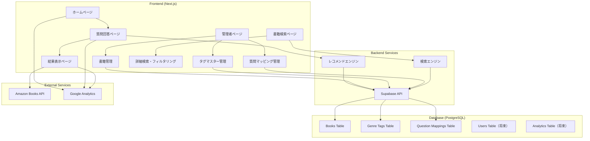
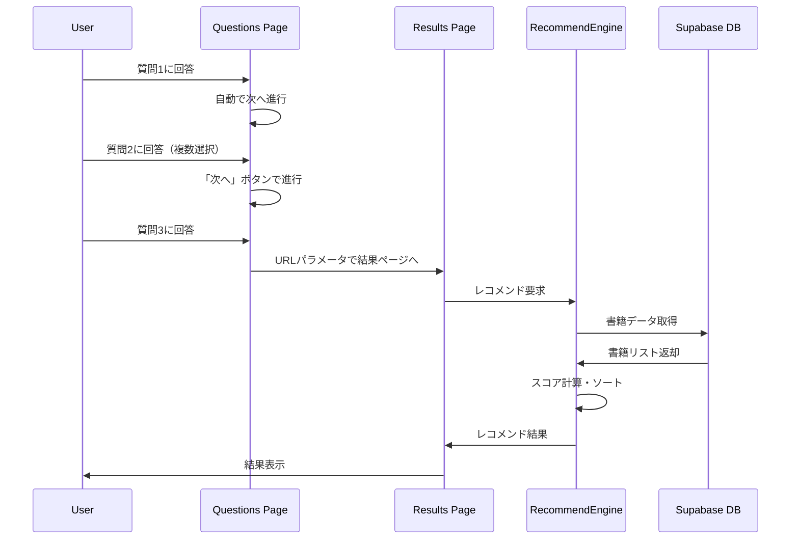
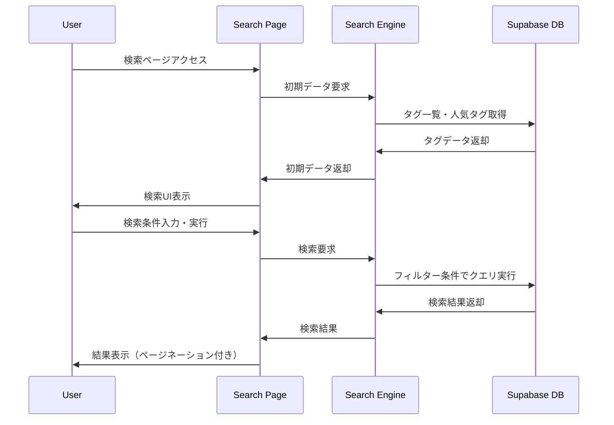
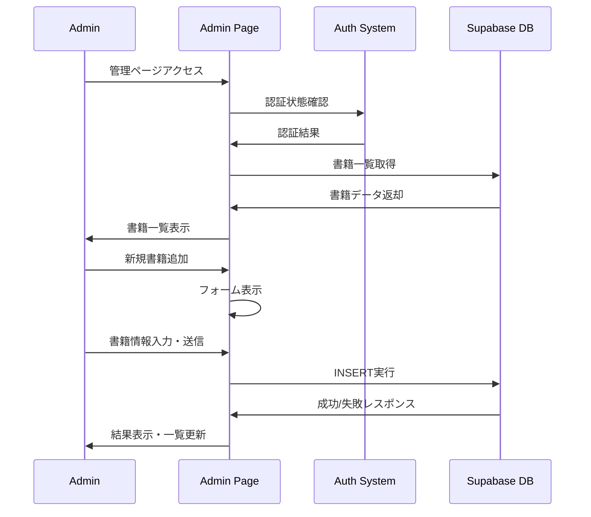
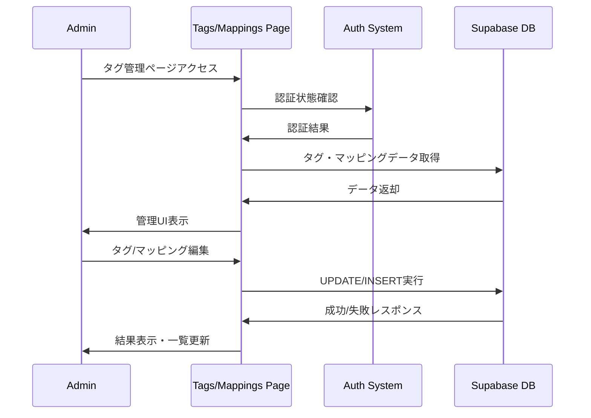

# 🏗️ システムアーキテクチャ設計書

**最終更新日: 2025年09月03日**

## 概要

質問ベースの書籍レコメンドシステムの技術アーキテクチャ、データ設計、およびシステム構成について説明します。

---

## システム構成図



---

## 技術スタック

### フロントエンド
- **Framework**: Next.js 14.2.5 (App Router)
- **Language**: TypeScript 5
- **Styling**: Tailwind CSS 3.4.1 + カスタムiOS風デザインシステム
- **State Management**: React Hooks (useState, useEffect)
- **Routing**: Next.js App Router
- **UI Libraries**: clsx, tailwind-merge

### バックエンド
- **BaaS**: Supabase 2.44.2 (PostgreSQL + Auth + API)
- **API**: Next.js API Routes (必要に応じて)
- **Authentication**: カスタム認証システム (固定アカウント方式)

### データベース
- **Primary DB**: PostgreSQL (Supabase)
- **ORM**: Supabase Client SDK
- **Migration**: Supabase CLI
- **Schema**: Books, Genre Tags, Question Mappings テーブル

### デプロイ・インフラ
- **Hosting**: Vercel
- **CDN**: Vercel Edge Network
- **Environment**: Serverless Functions
- **Analytics**: Google Analytics (G-8YPNZ4VYKX)

### 開発ツール
- **Package Manager**: npm
- **Linting**: ESLint 8 + Next.js config
- **Type Checking**: TypeScript 5
- **CSS Processing**: PostCSS + Autoprefixer

---

## データベース設計

### Books Table

```sql
CREATE TABLE books (
  id UUID DEFAULT gen_random_uuid() PRIMARY KEY,
  title VARCHAR(255) NOT NULL,
  author VARCHAR(255) NOT NULL,
  genre_tags TEXT[] NOT NULL DEFAULT '{}',
  amazon_link TEXT NOT NULL,
  summary_link TEXT,
  cover_image_url TEXT,
  description TEXT,
  page_count INTEGER,
  price DECIMAL(10,2),
  created_at TIMESTAMP WITH TIME ZONE DEFAULT NOW(),
  updated_at TIMESTAMP WITH TIME ZONE DEFAULT NOW()
);
```

### Genre Tags Table

```sql
CREATE TABLE genre_tags (
  id UUID DEFAULT gen_random_uuid() PRIMARY KEY,
  name VARCHAR(50) NOT NULL UNIQUE,
  description TEXT,
  category VARCHAR(50) NOT NULL,
  purpose_mapping TEXT[] DEFAULT '{}',
  display_order INTEGER DEFAULT 0,
  is_active BOOLEAN DEFAULT true,
  created_at TIMESTAMP WITH TIME ZONE DEFAULT NOW(),
  updated_at TIMESTAMP WITH TIME ZONE DEFAULT NOW()
);
```

### Question Mappings Table

```sql
CREATE TABLE question_mappings (
  id UUID DEFAULT gen_random_uuid() PRIMARY KEY,
  question_id VARCHAR(50) NOT NULL,
  question_type VARCHAR(20) NOT NULL,
  option_value VARCHAR(100) NOT NULL,
  mapped_tags TEXT[] NOT NULL DEFAULT '{}',
  weight DECIMAL(3,2) DEFAULT 1.0,
  created_at TIMESTAMP WITH TIME ZONE DEFAULT NOW(),
  updated_at TIMESTAMP WITH TIME ZONE DEFAULT NOW(),
  UNIQUE(question_id, option_value)
);
```

#### インデックス設計

```sql
-- 書籍テーブル用インデックス
CREATE INDEX idx_books_genre_tags ON books USING GIN (genre_tags);
CREATE INDEX idx_books_title ON books (title);
CREATE INDEX idx_books_author ON books (author);
CREATE INDEX idx_books_page_count ON books (page_count);
CREATE INDEX idx_books_price ON books (price);

-- タグマスター用インデックス
CREATE INDEX idx_genre_tags_category ON genre_tags (category);
CREATE INDEX idx_genre_tags_name ON genre_tags (name);
CREATE INDEX idx_genre_tags_display_order ON genre_tags (display_order);

-- 質問マッピング用インデックス
CREATE INDEX idx_question_mappings_question_id ON question_mappings (question_id);
CREATE INDEX idx_question_mappings_mapped_tags ON question_mappings USING GIN (mapped_tags);
```

#### Row Level Security (RLS)

```sql
-- Books: 読み取り権限（全ユーザー）
CREATE POLICY "Books are viewable by everyone" 
ON books FOR SELECT 
USING (true);

-- Books: 書き込み権限（認証済みユーザーのみ）
CREATE POLICY "Books are editable by authenticated users" 
ON books FOR ALL 
USING (auth.role() = 'authenticated');

-- Genre Tags: 読み取り権限（全ユーザー）
CREATE POLICY "Genre tags are viewable by everyone" 
ON genre_tags FOR SELECT 
USING (true);

-- Genre Tags: 書き込み権限（認証済みユーザーのみ）
CREATE POLICY "Genre tags are editable by authenticated users" 
ON genre_tags FOR ALL 
USING (auth.role() = 'authenticated');

-- Question Mappings: 読み取り権限（全ユーザー）
CREATE POLICY "Question mappings are viewable by everyone" 
ON question_mappings FOR SELECT 
USING (true);

-- Question Mappings: 書き込み権限（認証済みユーザーのみ）
CREATE POLICY "Question mappings are editable by authenticated users" 
ON question_mappings FOR ALL 
USING (auth.role() = 'authenticated');
```

### 将来拡張用テーブル

#### Users Table（将来実装）
```sql
CREATE TABLE users (
  id UUID DEFAULT gen_random_uuid() PRIMARY KEY,
  email VARCHAR(255) UNIQUE,
  preferences JSONB,
  created_at TIMESTAMP WITH TIME ZONE DEFAULT NOW()
);
```

#### Recommendations Log（将来実装）
```sql
CREATE TABLE recommendation_logs (
  id UUID DEFAULT gen_random_uuid() PRIMARY KEY,
  user_id UUID REFERENCES users(id),
  session_id VARCHAR(255),
  questions JSONB NOT NULL,
  recommended_books JSONB NOT NULL,
  clicked_books UUID[],
  created_at TIMESTAMP WITH TIME ZONE DEFAULT NOW()
);
```

---

## アプリケーション構造

### ディレクトリ構成

```
src/
├── app/                    # Next.js App Router
│   ├── admin/             # 管理者ページ
│   │   ├── page.tsx       # 書籍管理画面
│   │   ├── mappings/      # 質問マッピング管理
│   │   │   └── page.tsx   # マッピング設定画面
│   │   └── tags/          # タグマスター管理
│   │       └── page.tsx   # タグ管理画面
│   ├── questions/         # 質問回答フロー
│   │   └── page.tsx       # 質問UI
│   ├── results/          # レコメンド結果
│   │   └── page.tsx       # 結果表示
│   ├── search/           # 書籍検索機能
│   │   └── page.tsx       # 検索・フィルタリング画面
│   ├── globals.css        # グローバルスタイル
│   ├── layout.tsx         # ルートレイアウト
│   ├── layout-client.tsx  # クライアントサイドレイアウト
│   └── page.tsx          # ホームページ
├── components/
│   ├── auth/             # 認証システム
│   │   ├── AuthContext.tsx # 認証コンテキスト
│   │   ├── LoginModal.tsx  # ログインモーダル
│   │   └── ProtectedRoute.tsx # 認証ガード
│   ├── layout/
│   │   └── Header.tsx     # ヘッダーコンポーネント
│   └── ui/               # 再利用可能UIコンポーネント
│       ├── Button.tsx     # iOS風ボタン
│       ├── Card.tsx       # カードコンポーネント
│       ├── Input.tsx      # フォーム入力
│       └── ProgressIndicator.tsx # 進捗表示
├── data/
│   └── questions.ts      # 質問データ定義
├── lib/
│   ├── supabase.ts      # Supabase設定・型定義
│   ├── recommendation.ts # レコメンドロジック
│   ├── search.ts        # 検索・フィルタリング機能
│   └── utils.ts         # ユーティリティ関数
├── types/
│   └── index.ts         # TypeScript型定義
└── middleware.ts        # Next.js ミドルウェア
docs/                    # 設計書・ドキュメント
├── architecture.md      # システムアーキテクチャ設計書
├── recommendation-logic.md # レコメンドロジック詳細
└── testing/
    └── uat-specification.md # UAT仕様書
supabase/               # データベース設定
├── schema.sql         # テーブル定義・初期データ
├── migration/         # マイグレーションファイル
│   ├── books_rows.sql
│   ├── book_tags_rows.sql
│   └── tags_rows.sql
├── initial_data*.sql  # 初期データファイル群
├── tag_categories.sql
└── tag_categories_setup.md
```

#### インデックス設計

```sql
-- 書籍テーブル用インデックス
CREATE INDEX idx_books_genre_tags ON books USING GIN (genre_tags);
CREATE INDEX idx_books_title ON books (title);
CREATE INDEX idx_books_author ON books (author);
CREATE INDEX idx_books_page_count ON books (page_count);
CREATE INDEX idx_books_price ON books (price);

-- タグマスター用インデックス
CREATE INDEX idx_genre_tags_category ON genre_tags (category);
CREATE INDEX idx_genre_tags_name ON genre_tags (name);
CREATE INDEX idx_genre_tags_display_order ON genre_tags (display_order);

-- 質問マッピング用インデックス
CREATE INDEX idx_question_mappings_question_id ON question_mappings (question_id);
CREATE INDEX idx_question_mappings_mapped_tags ON question_mappings USING GIN (mapped_tags);
```

#### Row Level Security (RLS)

```sql
-- Books: 読み取り権限（全ユーザー）
CREATE POLICY "Books are viewable by everyone" 
ON books FOR SELECT 
USING (true);

-- Books: 書き込み権限（認証済みユーザーのみ）
CREATE POLICY "Books are editable by authenticated users" 
ON books FOR ALL 
USING (auth.role() = 'authenticated');

-- Genre Tags: 読み取り権限（全ユーザー）
CREATE POLICY "Genre tags are viewable by everyone" 
ON genre_tags FOR SELECT 
USING (true);

-- Genre Tags: 書き込み権限（認証済みユーザーのみ）
CREATE POLICY "Genre tags are editable by authenticated users" 
ON genre_tags FOR ALL 
USING (auth.role() = 'authenticated');

-- Question Mappings: 読み取り権限（全ユーザー）
CREATE POLICY "Question mappings are viewable by everyone" 
ON question_mappings FOR SELECT 
USING (true);

-- Question Mappings: 書き込み権限（認証済みユーザーのみ）
CREATE POLICY "Question mappings are editable by authenticated users" 
ON question_mappings FOR ALL 
USING (auth.role() = 'authenticated');
```

---

## 現在の機能一覧

### パブリック機能
- **ホームページ** (`/`): システム概要と質問開始
- **質問回答** (`/questions`): 2つの質問による嗜好収集
- **結果表示** (`/results`): レコメンド結果とAmazonリンク
- **書籍検索** (`/search`): タグ・タイトル・著者による検索機能

### 管理者機能（認証必須）
- **書籍管理** (`/admin`): 書籍の追加・編集・削除
- **タグマスター管理** (`/admin/tags`): ジャンルタグの管理
- **質問マッピング管理** (`/admin/mappings`): 質問選択肢とタグの紐付け設定

### システム機能
- **認証システム**: 固定アカウントによる管理者認証
- **フォールバック機能**: Supabase接続失敗時のモックデータ表示
- **レスポンシブデザイン**: iOS風UI/UXデザインシステム
- **アナリティクス**: Google Analytics連携

### 検索・フィルタリング機能
- タグベース検索（複数選択可）
- タイトル・著者による部分一致検索
- ページ数・価格によるフィルタリング
- 人気タグによるクイック検索
- ページネーション対応

---

## データフロー

### 1. 質問回答フロー



### 2. 書籍検索フロー



### 3. 書籍管理フロー



### 4. タグ・マッピング管理フロー



---

## レコメンドエンジン詳細

### クラス構造

```typescript
export class RecommendationEngine {
  // メイン処理
  static async getRecommendations(responses: QuestionResponse): Promise<RecommendationResult[]>
  
  // スコア計算（プライベート）
  private static calculateScore(book: Book, responses: QuestionResponse, mappings: any[]): number
  private static getPurposeScore(book: Book, purpose: string, mappings: any[]): number
  private static getGenreScore(book: Book, genres: string[], mappings: any[]): number
  private static getReadabilityScore(book: Book): number
  private static getPriceScore(book: Book): number
  
  // マッチ理由生成
  private static getMatchReasons(book: Book, responses: QuestionResponse, mappings: any[]): string[]
  
  // フォールバック（モックデータ）
  static getMockRecommendations(responses: QuestionResponse): RecommendationResult[]
}
```

### 検索エンジン詳細

```typescript
// 検索フィルタリング機能
export interface SearchFilters {
  tags?: string[];
  title?: string;
  author?: string;
  minPages?: number;
  maxPages?: number;
  minPrice?: number;
  maxPrice?: number;
}

export async function searchBooks(filters: SearchFilters, page: number, pageSize: number): Promise<SearchResult>
export async function getAvailableTags(): Promise<string[]>
export async function getPopularTags(limit?: number): Promise<Array<{ tag: string; count: number }>>
export async function getSeparatedTags(): Promise<{ genreTags: Array<{ tag: string; count: number }> }>
export async function getTagCategories(): Promise<Array<{ category: string; description: string; tags: Array<{ tag: string; count: number }> }>>
```

### 認証システム詳細

```typescript
export interface AuthContextType {
  user: User | null;
  login: (email: string, password: string) => Promise<boolean>;
  logout: () => void;
  isLoading: boolean;
}

// 固定アカウント認証方式
// ローカルストレージベースのセッション管理
```

### パフォーマンス特性

#### 時間計算量
- **書籍数**: N
- **選択ジャンル数**: G
- **関連タグ数**: T

**総合計算量**: O(N × (T + G))

#### 実際の処理時間（推定）
- 100冊: ~10ms
- 1,000冊: ~100ms
- 10,000冊: ~1秒

#### 最適化戦略
1. **インデックス活用**: ジャンルタグのGINインデックス
2. **キャッシュ**: 人気組み合わせの事前計算
3. **段階的処理**: 上位候補のみ詳細計算

---

## セキュリティ設計

### 認証・認可
- **パブリックページ**: ホーム、質問、結果、検索（認証不要）
- **管理者ページ**: カスタム認証システムによる固定アカウント認証
- **API**: Row Level Security（RLS）による制御
- **セッション管理**: ローカルストレージベース

### データ保護
- **機密情報**: 環境変数での管理
- **入力検証**: TypeScriptによる型安全性
- **SQLインジェクション**: Supabase ORMによる防御
- **管理者認証**: 固定アカウント方式（email + password）

### プライバシー
- **ユーザー追跡**: Google Analyticsによる匿名統計のみ
- **セッション**: クライアントサイドのみ
- **ログ**: 個人情報を含まない
- **質問回答データ**: サーバーに保存せず

---

## 監視・分析

### 現在の実装
- **エラーハンドリング**: try-catch + コンソールログ
- **フォールバック**: Supabase接続失敗時のモックデータ
- **アクセス解析**: Google Analytics (G-8YPNZ4VYKX) 実装済み
- **パフォーマンス監視**: 各ページの読み込み時間追跡

### 将来拡張
- **エラー監視**: Sentry連携
- **詳細分析**: Core Web Vitals追跡
- **ビジネス指標**: CTR、コンバージョン率、検索パターン分析
- **A/Bテスト**: レコメンドアルゴリズムの改善検証

---

## 拡張性・保守性

### 水平スケーリング
- **フロントエンド**: Vercel Edge Networkによる自動スケール
- **バックエンド**: Supabaseによる自動スケール
- **データベース**: PostgreSQL読み込みレプリカ

### 機能拡張ポイント
1. **質問項目**: `src/data/questions.ts`で定義
2. **レコメンドロジック**: `src/lib/recommendation.ts`で重み調整
3. **検索機能**: `src/lib/search.ts`でフィルタリング拡張
4. **タグマスター**: データベース `genre_tags` テーブルで動的管理
5. **質問マッピング**: データベース `question_mappings` テーブルで柔軟な設定
6. **デザインシステム**: `tailwind.config.ts`でスタイル変更

### 保守性
- **型安全性**: TypeScriptによる静的チェック
- **コンポーネント化**: 再利用可能なUIコンポーネント
- **設定外部化**: 環境変数による設定管理

---

## デプロイ戦略

### 環境構成
- **Development**: ローカル開発環境
- **Preview**: Vercel Preview（PR作成時）
- **Production**: Vercel Production

### CI/CD
```yaml
# 自動実行されるフロー
1. コード変更 (Git Push)
2. Vercel自動ビルド
3. TypeScript型チェック
4. ESLint実行
5. プレビューデプロイ
6. 本番デプロイ（mainブランチ）
```

### 環境変数管理
```bash
# 必須環境変数
NEXT_PUBLIC_SUPABASE_URL=
NEXT_PUBLIC_SUPABASE_ANON_KEY=
SUPABASE_SERVICE_ROLE_KEY=
```

---

## パフォーマンス最適化

### フロントエンド
- **Code Splitting**: Next.js自動分割
- **Image Optimization**: Next.js Image最適化
- **CSS**: Tailwind CSS Purge

### バックエンド
- **Database**: インデックス最適化
- **Caching**: Supabase自動キャッシュ
- **CDN**: Vercel Edge Network

### 測定指標
- **LCP**: < 2.5秒
- **FID**: < 100ms
- **CLS**: < 0.1

---

## 障害対応・復旧

### 障害パターンと対応

| 障害 | 原因 | 対応 | 復旧時間 |
|------|------|------|----------|
| Supabase接続エラー | ネットワーク/認証 | モックデータフォールバック | 即座 |
| Vercel障害 | インフラ問題 | Vercel Status確認 | Vercel依存 |
| データベース障害 | Supabase問題 | 読み取り専用モード | Supabase依存 |

### 監視項目
- **稼働率**: 99.9%目標
- **レスポンス時間**: < 3秒
- **エラー率**: < 1%

---

## まとめ

本システムは、モダンなWebアプリケーションアーキテクチャを採用し、拡張性と保守性を重視した設計となっています。

**主な特徴**:
- JAMstack構成による高いパフォーマンス
- Supabase BaaSによる開発効率向上
- TypeScriptによる型安全性
- iOS風デザインシステムによる一貫したUX
- フォールバック機構による高い可用性
- 動的タグ管理システムによる柔軟なレコメンド調整
- 高機能検索・フィルタリングシステム
- Google Analytics連携による使用状況追跡

**2025年9月時点での拡張機能**:
- タグマスターによる動的ジャンル管理
- 質問マッピングによる柔軟なレコメンドロジック調整
- 書籍検索機能（複数条件によるフィルタリング）
- 管理者向けデータ管理インターフェース
- Google Analytics統合によるユーザー行動分析

今後のユーザー増加や機能拡張にも柔軟に対応できる基盤を構築しています。